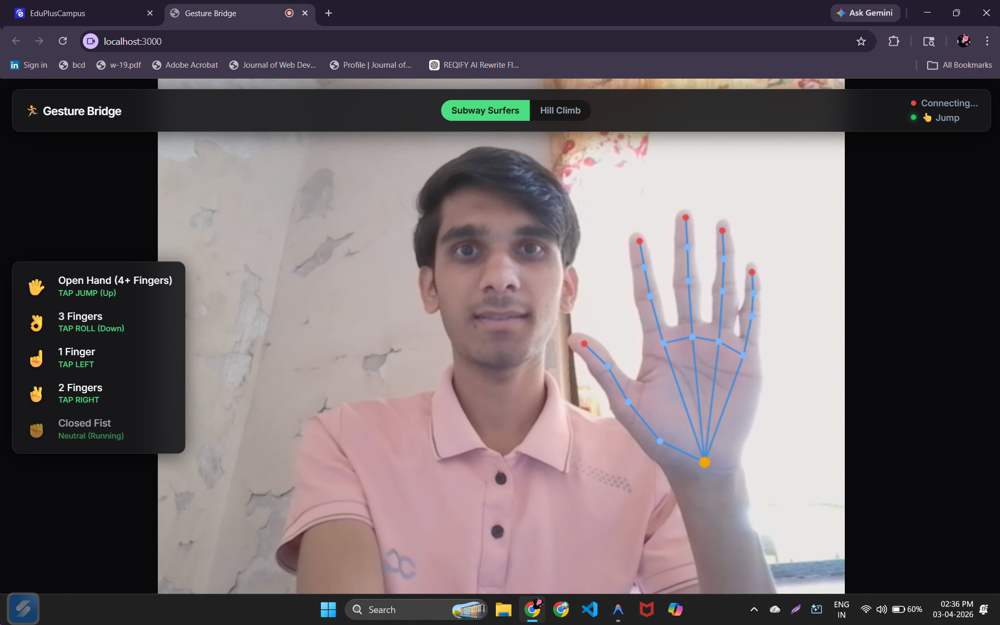
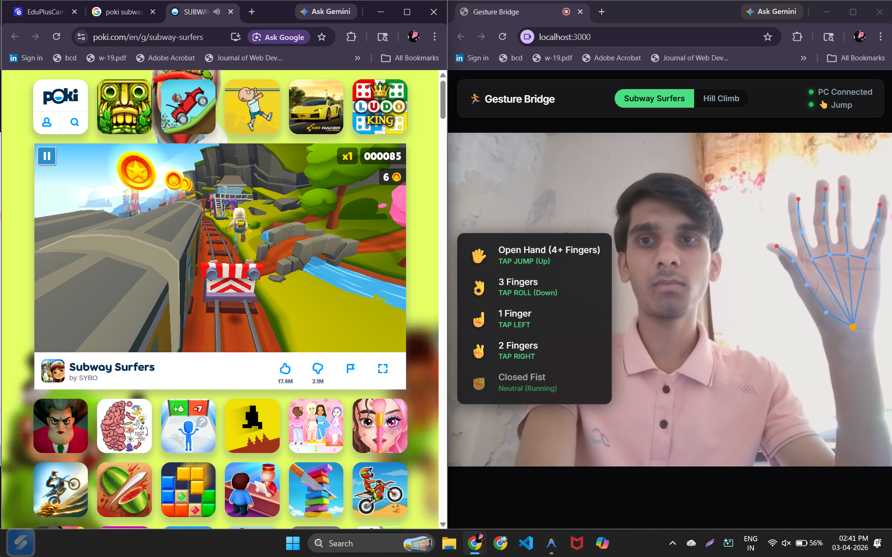
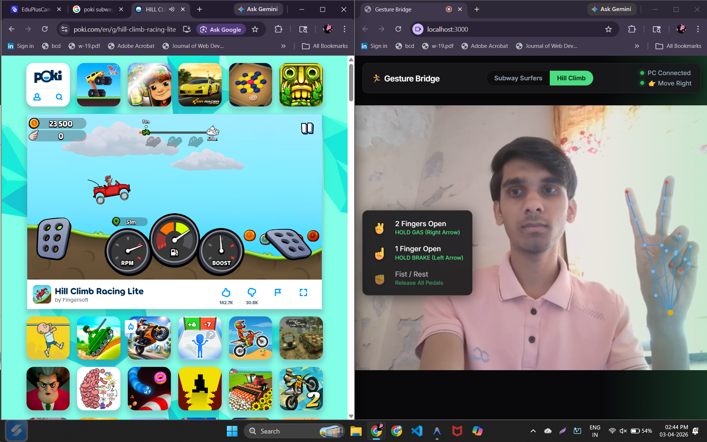

# Gesture-Controlled PC Game Bridge 🎮✋

Welcome to the **Gesture-Controlled PC Game Bridge**! This project replaces static directional controls with a robust, velocity-based hand tracking system. It lets you play PC cursor-driven or keyboard-driven games (like Subway Surfers, racing games, etc.) entirely using real-time webcam hand gestures.

## 🌟 Features

- **Real-Time Hand Tracking:** Utilizes a web browser-based frontend for low-latency hand gesture detection.
- **Velocity-Based Swipes:** Tracks the speed and direction of your hand to execute accurate jumping, rolling, and lane-switching controls.
- **Python Automation Server:** A robust Python backend server receives WebSocket commands and translates them instantaneously into OS-level keystrokes.
- **Multi-Game Compatibility:** Configurable to send custom keystrokes mapping to various games.
- **Zero-Touch Interaction:** Play hands-free!

---

## 📸 Screenshots & Demos

*(Add your images in the `images/` directory!)*

### Gameplay Screenshots

1. **Main Dashboard**
   
   *The primary control window where you can view your real-time hand skeleton and calibrate gesture sensitivity.*

2. **Subway Surfers Bridge**
   
   *Action shot of a 'Swipe Up' gesture being translated into a character jump within Subway Surfers.*

3. **Hill Climb Racing Bridge**
   
   *Demonstrating continuous key-holding gestures to control acceleration and braking in Hill Climb Racing.*

### Short Demo Video
*Watch the gesture bridge in action!*

<video src="./images/gestureGame.mp4" controls="controls" style="max-width: 100%;">
  Your browser does not support the video tag.
</video>

---

## 🛠️ Technologies Used

### Frontend (Gesture Recognition)
- Vanilla HTML, CSS, JavaScript
- **Vite** - Build tool and development server
- Computer Vision / Pose Detection libraries (MediaPipe/TensorFlow.js)

### Backend (Keyboard Automation)
- **Python 3.x**
- `websockets` - Handles real-time communication with the browser
- `pydirectinput` - Simulates DirectInput keyboard press events at the OS level (DirectX compatible)

---

## 🚀 Getting Started

### Prerequisites

- **Node.js** and **npm** (for the frontend app)
- **Python 3.8+** (for the backend server)

### 1. Backend Setup (Python)

1. Open a terminal and navigate to the project root:
   ```bash
   cd path/to/gesture-runner
   ```
2. Install the required Python packages:
   ```bash
   pip install websockets pydirectinput
   ```
3. Run the Python server:
   ```bash
   python server.py
   ```
   *The server will start listening on `ws://localhost:8765`.*

### 2. Frontend Setup (JavaScript)

1. Open a **new** terminal window matching the project root.
2. Install Node dependencies:
   ```bash
   npm install
   ```
3. Run the dev server:
   ```bash
   npm run dev
   ```
4. Open the development URL (e.g., `http://localhost:5173`) in your browser.
5. **Allow Webcam Permissions** when prompted.

---

## 🎮 How to Play

Once both the Server and Frontend are running:

1. Stand in front of your webcam ensuring your hands are clearly visible.
2. **Swipe Up:** Sends `Up Arrow` (Jump)
3. **Swipe Down:** Sends `Down Arrow` (Slide/Roll)
4. **Swipe Left/Right:** Sends `Left/Right Arrow` (Switch Lanes)
5. **Hold/Release:** Some gestures support holding down keys for continuous input.

The terminal running `server.py` will log all matched gesture inputs in real-time!

---

## 🏗️ Architecture Setup

1. **Web Frontend:** Captures camera feed, processes frames via the AI model to detect landmarks, and calculates swipe velocities.
2. **WebSocket Bridge:** Hand action data stream is packaged into JSON messages and routed instantly locally to the Python server.
3. **Automated Input:** The Python server parses JSON and triggers `pydirectinput`, simulating physical keyboard strokes recognized by standalone PC games.

---

## 🤝 Contributing

Contributions, issues, and feature requests are welcome. Feel free to check the issues page if you want to contribute.


